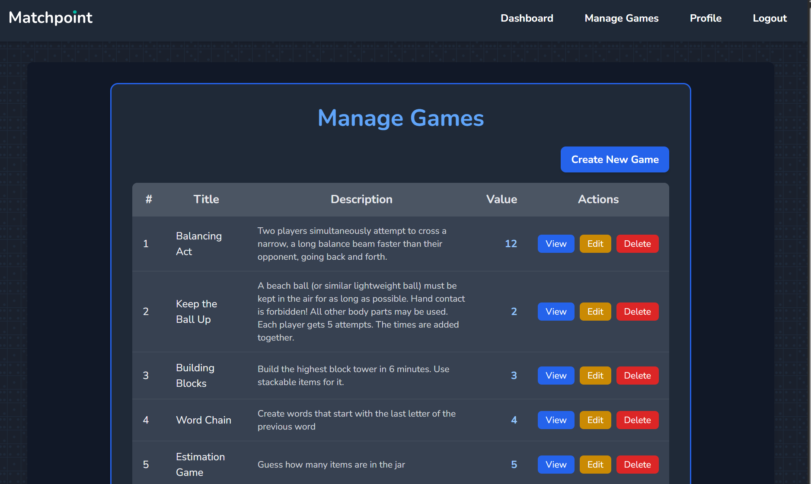

# 🎮 Matchpoint - Real-Time Game Show Platform

[](https://nodejs.org/)
[](https://reactjs.org/)
[](https://www.mysql.com/)
[](https://socket.io/)

A modern, real-time multiplayer game show platform inspired by Kahoot and TV game shows like "Schlag den Raab". Create matches, join with friends, and compete in various mini-games with live scoreboards and instant updates.

---

## 🌐 **Link to my page**
[Click here to visit the app!](https://cc241070-10749.node.fhstp.cc/)

---

## 📸 Screenshots
| Homepage | Dashboard | Games | Hostlobby
|:---:|:---:|:---:|:---:|
|  |  |  | 

| Game View | Scoreboard | Player View | Winner
|:---:|:---:|:---:|:---:|
|  |  |  | 

## ✨ Features

### 🎯 Core Functionality
- **Real-time multiplayer gaming** with Socket.IO
- **Live scoreboards** and instant updates
- **Room-based match system** with unique 4-digit codes
- **Host and player roles** with different interfaces
- **Game sequence management** - multiple games per match
- **JWT-based authentication** with secure user management

### 🎮 Game Features
- **IRL Mini-Games** - Physical games that can be played in person
- **Real-time synchronization** - All players see updates instantly
- **Score tracking** - Automatic point calculation and leaderboards
- **Match progression** - Seamless transitions between games
- **Final results** - Winner determination and match summaries

### 🛠 Technical Features
- **Responsive design** - Works on desktop and mobile
- **Cross-platform compatibility** - Accessible from any device on the network
- **Connection pooling** - Robust database handling
- **Error handling** - Graceful error recovery and user feedback
- **Environment configuration** - Easy setup for different deployments

### Main Interface
- Dashboard with match creation and joining
- Host lobby with real-time player list
- Player lobby with join status
- Game interface with instructions
- Live scoreboard with rankings
- Final results page

## 🚀 Quick Start

### Prerequisites
- **Node.js** (v16 or higher)
- **MySQL** (v8.0 or higher)
- **Git**

### Installation

1. **Clone the repository**
   ```bash
   git clone <your-repo-url>
   cd SS2025_CCL_cc241070
   ```

2. **Install dependencies**
   ```bash
   # Backend dependencies
   cd backend
   npm install
   
   # Frontend dependencies
   cd ../frontend
   npm install
   ```

3. **Database setup**
   ```bash
   # Create MySQL database and user
   mysql -u root -p
   CREATE DATABASE matchpoint_db;
   CREATE USER 'matchpoint_user'@'localhost' IDENTIFIED BY 'your_password';
   GRANT ALL PRIVILEGES ON matchpoint_db.* TO 'matchpoint_user'@'localhost';
   FLUSH PRIVILEGES;
   EXIT;
   ```

4. **Environment configuration**

   **Backend** (create `backend/.env`):
   ```env
   NODE_ENV=development
   PORT=3000
   DB_USERNAME=matchpoint_user
   DB_PASSWORD=your_password
   DB_NAME=matchpoint_db
   ACCESS_TOKEN_SECRET=your_super_secret_jwt_key_here
   FRONTEND_URL=http://localhost:5173
   ```

   **Frontend** (create `frontend/.env`):
   ```env
   VITE_API_URL=http://localhost:3000
   VITE_SOCKET_SERVER_URL=http://localhost:3000
   ```

5. **Start the application**
   ```bash
   # Terminal 1: Backend
   cd backend
   npm start
   
   # Terminal 2: Frontend
   cd frontend
   npm run dev
   ```

6. **Access the application**
   - Frontend: http://localhost:5173
   - Backend API: http://localhost:3000

## 🎯 Usage

### Creating a Match
1. **Register/Login** to your account
2. **Click "Create New Match"** on the dashboard
3. **Enter match name** and select games for the sequence
4. **Share the room code** with players (e.g., "1234")

### Joining a Match
1. **Enter the room code** on the dashboard
2. **Click "Join Match"** to enter the lobby
3. **Wait for the host** to start the game

### Hosting a Game
1. **Monitor the lobby** for joining players
2. **Click "Start Match"** when ready
3. **Follow game instructions** and award points
4. **Advance through games** until completion

## 🏗 Architecture

### Frontend
- **React 19** with modern hooks and functional components
- **Vite** for fast development and building
- **Tailwind CSS** for responsive styling
- **Socket.IO Client** for real-time communication
- **React Router** for navigation

### Backend
- **Node.js** with Express.js framework
- **Socket.IO** for real-time bidirectional communication
- **MySQL** database with connection pooling
- **JWT** for secure authentication
- **Bcrypt** for password hashing

### Real-time Features
- **Live player updates** - See who joins/leaves instantly
- **Score synchronization** - All players see score changes
- **Game state management** - Synchronized game progression
- **Match status updates** - Real-time match state changes

## 🔧 Configuration

### Environment Variables
See `ENVIRONMENT_SETUP.md` for detailed configuration options.

### Network Access
To access from other devices on your network:
1. Find your IP address (`ipconfig` on Windows)
2. Update environment variables with your IP
3. Restart both servers

### Production Deployment
- Set `NODE_ENV=production`
- Use HTTPS URLs
- Configure proper domain names
- Set up production database
- Use environment-specific secrets

## 🛠 Development

### Project Structure
```
SS2025_CCL_cc241070/
├── backend/                 # Node.js/Express server
│   ├── controllers/        # Request handlers
│   ├── models/            # Database models
│   ├── routes/            # API routes
│   ├── services/          # Business logic
│   └── server.js          # Main server file
├── frontend/              # React application
│   ├── src/
│   │   ├── components/    # React components
│   │   ├── services/      # API and Socket.IO clients
│   │   └── assets/        # Images and static files
│   └── vite.config.js     # Vite configuration
└── docs/                  # Documentation and screenshots
```

### Available Scripts
```bash
# Backend
npm start          # Start production server
npm run dev        # Start development server with nodemon

# Frontend
npm run dev        # Start development server
npm run build      # Build for production
npm run preview    # Preview production build
```
